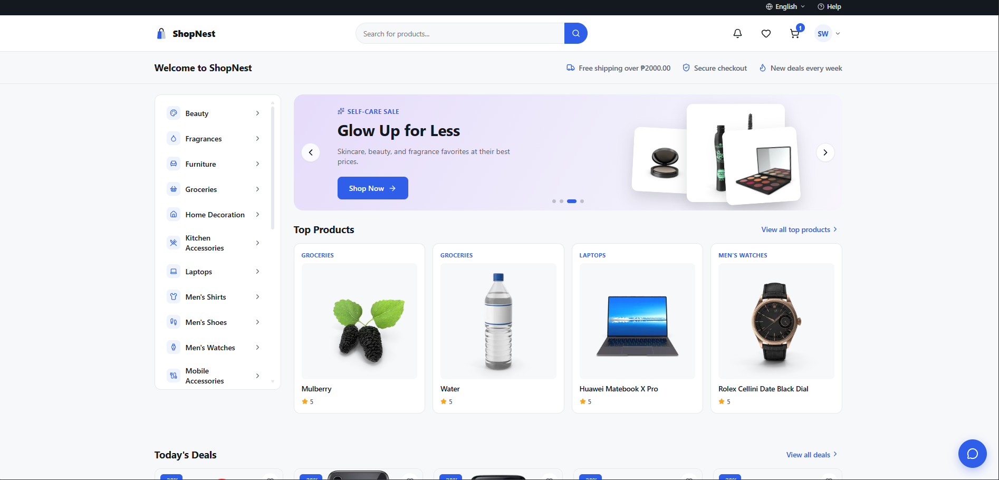

# ShopNest

A React + Vite storefront demo: product browsing, filters, cart, wishlist, and a multi-step checkout flow, priced in PHP.

**Live demo:** [shop-nest-ten-rho.vercel.app](https://shop-nest-ten-rho.vercel.app/)



Built to practice production-style frontend patterns beyond typical tutorial projects — real routing, state persistence, and test coverage on a full storefront flow (browse → filter → cart → checkout).

**Tech stack:** React 19 · TypeScript · Vite · React Router · Vitest + React Testing Library

## Stack notes

- **Routing**: React Router (`react-router-dom`) — real URLs per page (`/`, `/shop`, `/product/:id`, `/wishlist`, `/checkout`), shareable/deep-linkable, browser back/forward works.
- **Persistence**: cart, applied coupon, and wishlist persist to `localStorage` via small reusable hooks (`src/utils/useLocalStorage.ts`, `src/utils/useLocalStorageReducer.ts`), so a refresh doesn't wipe the cart.
- **Testing**: Vitest + React Testing Library. Run `npm test` (single run) or `npm run test:watch`. Covers cart totals math (subtotal/discount/shipping/tax), coupon logic, and the localStorage persistence hooks.

## Known limitations

This is a frontend demo, not a production storefront:

- **Checkout is simulated.** The payment step doesn't talk to a real processor, and the order ID on the confirmation screen is randomly generated client-side — no order is actually persisted anywhere.
- **Catalog comes from a public demo API** ([dummyjson.com](https://dummyjson.com)), converted to PHP pricing at fetch time. There's no backend of my own and no admin/inventory system.
- **No authentication or user accounts.** Cart and wishlist are scoped to the browser via `localStorage`, not to a logged-in user.

## Lighthouse scores
Performance 90-99 · Accessibility 95 · Best Practices 100 · SEO 92
(measured locally via Chrome DevTools, incognito)

## Scripts

```
npm run dev          # start dev server
npm run build         # production build
npm run preview       # preview the production build
npm test              # run the test suite once
npm run test:watch    # run tests in watch mode
npm run lint           # oxlint
```